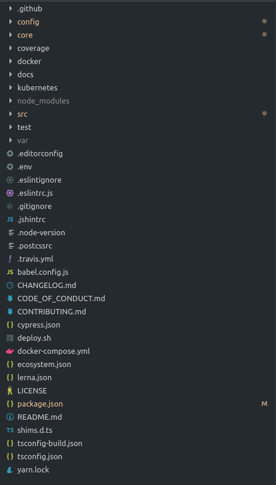
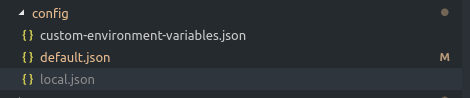
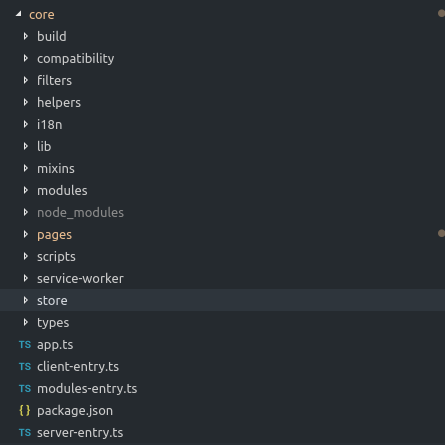
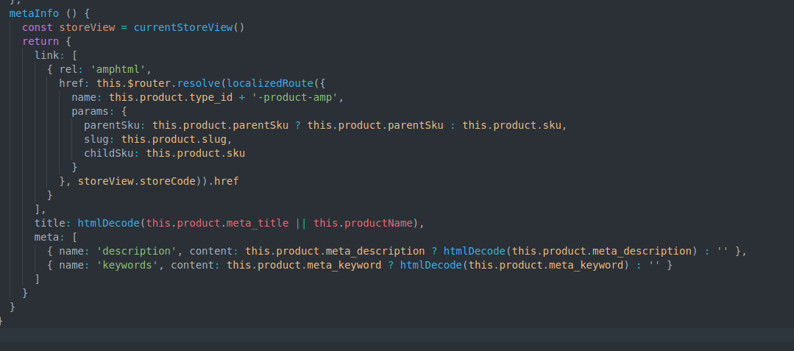

# Vue Storefront - 前端整理
## 安装

```shell
git clone https://github.com/DivanteLtd/vue-storefront.git vue-storefront
cd vue-storefront
yarn
yarn installer
```

在`yarn installer`之后会受到提示

```
Would you like to use https://demo.vuestorefront.io as the backend?
```

官方提供了远程后端 https://demo.vuestorefront.io ,用于运行参考前端代码,否则需要安装`vue-storefront-api`,参考#3

## 目录结构
从项目的目录来看,最需要关注的地方是 config, core, src



### config



该文件夹内用于定义商城的后端地址和当前主题,包括部分页面显示的数据内容等.

通过`node-config`插件来管理配置文件

- `default.json` - 默认的配置文件,不应更改

- `local.json` - 自定义配置文件,该文件配置的内容将会覆盖`default.json`

### core



- `build` - 文件内包含`config.json`文件和`webpack`的配置文件
- `compatibility` - 旧的公共组件(官方建议不要使用,将迁移至lib中)
- `filters` - 过滤器(管道)
- `helpers` - log方法和错误提示
- `i18n` - 全球化
- `lib` - 核心代码库, 包含主题的支持和模块,和`ssr`等
- `mixins` - 核心代码混淆(类似于依赖注入)
- `modules` - 核心功能模块,包括购物车模块,用户模块,结账模块等
- `pages` - 核心页面
- `store` - Vuex store(官方提示,将迁移至modules和lib中)
- `type` - typescript interface

### src

- `themes` - 商城的核心主题,页面的HTML和css还有一些主题的定制组件

## 框架特点

#### 高度模块化-灵活的定制

该框架将页面的核心逻辑,公共功能模块放在`core`中,暴露清晰的接口,开箱即用,只需要在`src/themes`中定制需要的主题,通过一些HTML和CSS和主题逻辑,然后组装公用的核心模块即可.在主题中通过`mixins`注入core中的核心页面逻辑即可.


### [开箱即用的服务器端渲染](https://ssr.vuejs.org/)

#### 优势:

- 有利于SEO,搜索引擎爬虫可以抓取到完全渲染的页面
- 更快的显示页面内容(对于一个商城来讲,内容的显示时间通常与转化率为正比)

#### 需要考虑的问题

- 需要在Node.js server环境运行,需要占用更多的CPU资源


### 数据的请求方式

- api模式,使用elasticSearch DSL查询
- graphqi模式,使用[GraphQL](https://graphql.cn/learn/best-practices/)查询


### 主题切换

1. 复制default于`src/themes`中并将名字改为新的主题名
2. 更改新主题中`package.json`文件中的`name`属性
3. 复制`config/default.json`更名为`local.json`
4. 修改`theme`属性为对应的主题名

### SEO

1. SSR
2. 利于SEO的URL
3. 动态META

动态生成META使用了`vue-meta`插件
例如在产品详情页面中添加meta描述,则需在`core/pages/Product.js`中加入如下代码



# vue-storefront-api与magento2集成
### vue-storefront-api与magento2集成

#### 环境要求

**vue-storefront-api & Magento 2.0.X的系统环境要求如下:**

| 必要环境                  | 如何检查                                | 更多信息                                                     |
| :------------------------ | :-------------------------------------- | :----------------------------------------------------------- |
| Apache 2.2 or 2.4         | Ubuntu: `apache2 -v` CentOS: `httpd -v` | [Apache](http://devdocs.magento.com/guides/v2.0/install-gde/prereq/apache.html) |
| PHP 5.6.x, 7.0.2 or 7.0.6 | `php -v`                                | [PHP Ubuntu](http://devdocs.magento.com/guides/v2.0/install-gde/prereq/php-ubuntu.html) [PHP CentOS](http://devdocs.magento.com/guides/v2.0/install-gde/prereq/php-centos.html) |
| MySQL 5.6.x               | `mysql -u [root user name] -p`          | [MySQL](http://devdocs.magento.com/guides/v2.0/install-gde/prereq/mysql.html) |
|docker,docker-compose					| 	`docker -v`				| [Docker](https://docs.docker.com/)   |
| node& yarn| `node -v`  `yarn -v`|  |

---------------------------------------------------------------------------

#### 准备工作

1. 下载`vue-storefront-api`
   1. `git clone https://github.com/DivanteLtd/vue-storefront-api.git vue-storefront-api`
   2. `cd vue-storefront-api`
   3. `yarn install`

2. API运行需要的Docker环境

   - ElasticSearch
   - Redis
   - Kibana（可选）

   1. 进入到`vue-storefront-api`文件夹
   2. 执行命令`docker-compose up -d`,等待三个容器运行成功即可

---------------------------------------------------------------------

#### 下载magento2

  1.如果您[使用Composer下载安装Magento2](https://www.magentochina.org/blog/magento-guide/install-magento-2-1-with-composer.html)，请使用下面的命令.(推荐linux主机使用)

`composer create-project --repository-url=https://repo.magento.com/ magento/project-community-edition <installation directory name>`

   2.从github下载Magento2代码.
`git clone https://github.com/magento/magento2.git`

   3.如果没有Composer或者git环境,也可以直接下载Magento2的最新版.
 官方地址:https://github.com/magento/magento2/archive/develop.zip


   4.如果你对Docker熟悉可以查看Magento2的Docker镜像.

 Magento2 docker镜像:https://github.com/magento/magento2devbox-web

----------------------------------------------------------

#### 安装magento2

1. 把magento2压缩包解压到/var/www/html/magento2文件夹内

2. chown -R www-data.www-data /var/www/html/magento2

3. chmod -R 755 /var/www/html/magento2

4. 浏览器输入：localhost/magento2/setup
5. 按提示安装即可

-------------------------------------------------------------------------------------------------------------

#### 通过OAuth授权使用Magento 2 API

1. 安装完后转到Magento 2管理面板，然后单击：`system`→`Integrations`。

2. 单击`New Integration`并填写：
   - Name
   - password
   - 在“API权限”选项，勾选以下资源：
     - Catalog
     - Sales
     - My Account
     - Carts
     - Stores > Settings > Configuration > Inventory Section
     - Stores > Taxes
     - Stores > Attributes > Product
   - 保存

3. 在保存后，点击`Activate`会获取到以下几个OAuth访问权限信息：`consumerKey`,`consumerSecret`,`accessToken`,`accessTokenSecret`

4. 修改`vue-storefront-api`=> `config/local.json`配置文件,填上获取到的OAuth信息

   ```json
    "magento2": {
      "url": "http://yourLocalMagentoHost", 
      "imgUrl": "http://yourLocalMagentoHost/media/catalog/product",
      "assetPath": "/../var/magento2-sample-data/pub/media",
      "api": {
        "url": "http://yourLocalMagentoHost/rest",
        "consumerKey": "byv3730rhoulpopcq64don8ukb8lf2gq",
        "consumerSecret": "u9q4fcobv7vfx9td80oupa6uhexc27rb",
        "accessToken": "040xx3qy7s0j28o3q0exrfop579cy20m",
        "accessTokenSecret": "7qunl3p505rubmr7u1ijt7odyialnih9"
      }
    }
   ```

5.  到`vue-storefront-api`运行以下命令来执行Elasticsearch的所有产品，类别和其他重要内容的完全导入
   `yarn mage2vs import`

-------------------------------------------------------------------------------------------------------------

#### 新增商品类别与商品

###### 1. 新增商品分类

1. 进入magento2控制面板,点击`catelog` => `categories`

2. 点击`Add Subcategory`后输入Category Name

   

###### 2. 新增商品

1. 进入magento2控制面板,点击`catelog` => `products`

2. 点击`Add product`,输入商品信息
   * ` Product Name`(商品名称)
   * ` SKU`(商品SKU)
   * ` Price`(商品单价)
   * `Quantity`(商品库存)
   * ` Visibility`(设置商品的可被查看区域,目录/搜索/不可见)
   * `Categories`(设置商品所属分类)
   * `Content`(设置商品描述与详情描述)
   * `Configurations`(设置商品配置信息,如:size/color.....)
   * `Images And Videos `(设置商品图片与视频)
   * `Search Engine Optimization `(搜索引擎优化,可自定义 Meta Keywords, Meta Description,Meta Title)
3. 保存商品信息,新增完成后需要再次到`vue-storefront-api`导入数据,执行命令
   `yarn mage2vs import`

